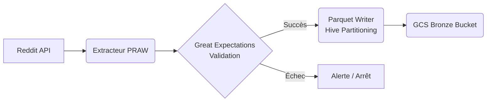

# Ingestion de données Reddit - Airflow

Cette section détaille le pipeline d'ingestion des données brutes depuis Reddit vers le layer **Bronze** (GCS).

## Architecture du Pipeline



## Composants Logiciels

### 1. `reddit_extractor.py`
Utilise la librairie **PRAW** pour se connecter à l'API Reddit.
- **Subreddits suivis :** `france`, `datascience`, `dataengineering`, `MachineLearning`, `BusinessIntelligence`.
- **Mode :** Récupération des "Top" posts sur les dernières 24h.

### 2. `data_validator.py`
Intègre **Great Expectations** pour garantir l'intégrité du Bronze Layer.
- Contrôles : Non-nullité des IDs, Unicité, Validité des types, Cohérence des dates.

### 3. `parquet_writer.py`
Transforme les DataFrames Pandas en fichiers **Parquet** compressés (**Snappy**).
- Implémente le partitionnement Hive : `bronze/posts/year=YYYY/month=MM/day=DD/`.

## Le DAG : `reddit_ingestion_pipeline`
- **Fréquence :** Toutes les 6 heures (configurable).
- **Rétention :** Les fichiers locaux sont temporaires (`/tmp`), le stockage définitif est sur GCS.
- **Variables Airflow requises :**
  - `reddit_client_id`
  - `reddit_client_secret`
  - `reddit_user_agent`
  - `project_id`
  - `reddit_bucket_name`

## Instructions d'Exécution

1. **Configuration des Secrets :**
   Dans l'interface Airflow de Cloud Composer, ajoutez les variables listées ci-dessus.

2. **Déploiement du Code :**
   Copiez les fichiers vers le bucket `dags` de Composer :
   ```bash
   gsutil cp airflow/dags/*.py gs://${COMPOSER_BUCKET}/dags/
   gsutil cp -r airflow/utils/ gs://${COMPOSER_BUCKET}/dags/
   ```

3. **Tests :**
   Déclenchez manuellement le DAG `reddit_ingestion_pipeline` pour vérifier le bon fonctionnement.

## Choix Techniques
- **PythonOperator :** Préféré ici pour la flexibilité de manipulation des DataFrames et l'intégration de Great Expectations.
- **Validation en amont :** On valide *avant* d'écrire en Bronze pour éviter de polluer le Data Lake avec des données corrompues, tout en gardant le format original (ELT-lite).
