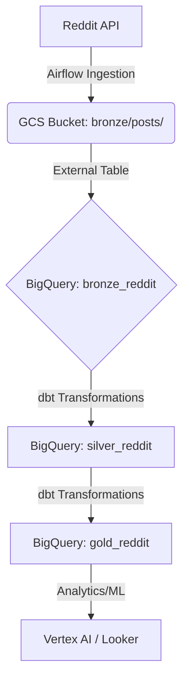

# Infrastructure GCP - Data Market Sentiment

Cette section contient le code Terraform pour déployer l'infrastructure de données sur Google Cloud Platform.

## Architecture de Stockage (Medallion)

L'architecture suit le pattern Medallion pour assurer la qualité et la traçabilité des données.



## Composants Déployés

### 1. Google Cloud Storage (GCS)
- **Bucket :** `${project}-reddit-analytics`
- **Prefixes :**
  - `bronze/` : Données brutes au format Parquet.
  - `ml_artifacts/` : Modèles et métadata ML.
  - `airflow_temp/` : Stockage temporaire pour Composer.
- **Cycle de Vie :**
  - Passage en **Nearline** après 90 jours.
  - Passage en **Coldline** après 365 jours.
  - **Suppression** après 730 jours.

### 2. BigQuery (Datasets)
- `bronze_reddit` : Contient la table externe `reddit_posts_ext` pointant vers GCS avec partitionnement Hive (year/month/day).
- `silver_reddit` : Données nettoyées (schéma typé, doublons supprimés).
- `gold_reddit` : Tables agrégées pour l'analyse du marché.

### 3. Cloud Composer 2
- **Version :** Airflow 2.x, Python 3.10.
- **Packages :** `praw`, `great-expectations`, `pandas`, `pyarrow`.
- **Rôle :** Orchestration de l'ingestion et des transformations (dbt).

### 4. IAM & Sécurité
- Un Service Account dédié `airflow-runner-${env}` avec le principe du moindre privilège :
  - `roles/storage.objectAdmin` sur le bucket de données.
  - `roles/bigquery.dataEditor` et `roles/bigquery.jobUser`.
  - `roles/composer.worker`.

## Instructions de Déploiement

> [!CAUTION]
> Assurez-vous d'avoir nettoyé l'ancienne infrastructure (Phase 0) avant de procéder.

1. **Initialisation :**
   ```bash
   cd terraform/environments/dev
   terraform init
   ```

2. **Planification :**
   ```bash
   terraform plan
   ```

3. **Application :**
   ```bash
   terraform apply
   ```

## Choix Techniques
- **Parquet vs JSON :** Le format Parquet est privilégié en Bronze pour optimiser les coûts de stockage et de lecture via BigQuery (colonnaire, compression).
- **Partitionnement Hive :** Permet à BigQuery de lire uniquement les fichiers nécessaires lors des requêtes sur les dates de collecte.
- **Cloud Composer 2 :** Solution managée pour Airflow 2, garantissant la scalabilité et la maintenance facilitée.
